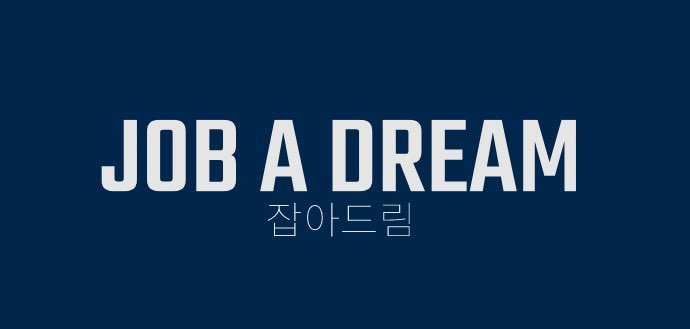
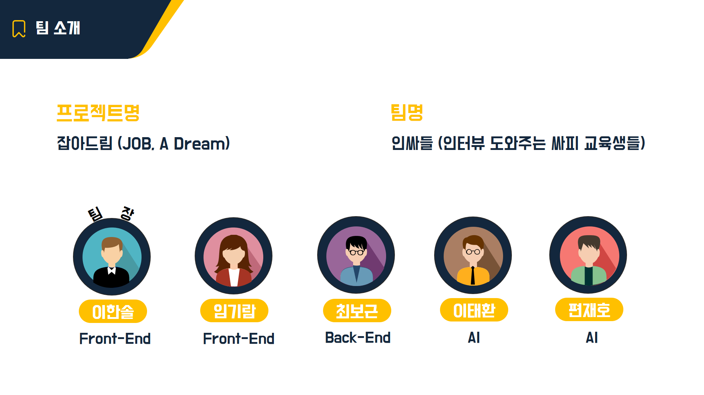
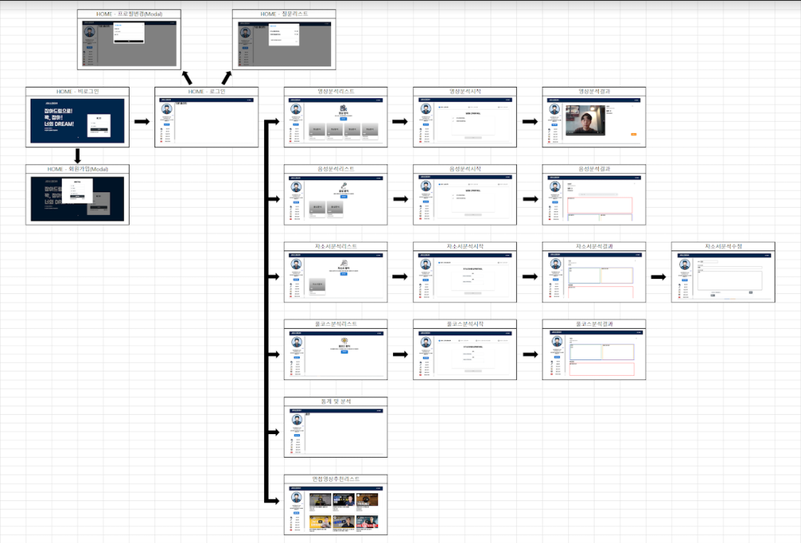
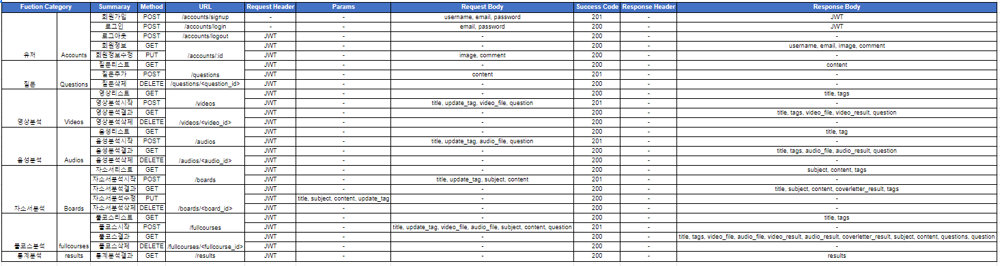
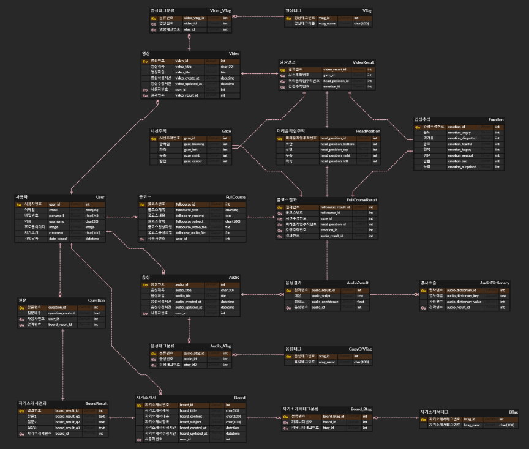
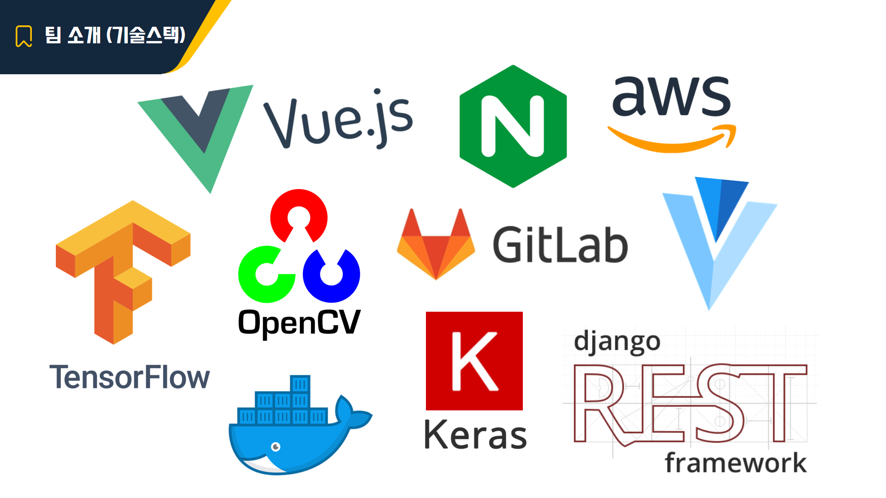

# :movie_camera: JOB A DREAM, 잡아드림! :microphone:



>시공간 제약을 극복하고 면접을 간접 경험할 수 있습니다. AI로 분석된 데이터를 통해 언어적, 비언어적 습관을 개선할 수 있고, 나만의 면접 데이터를 확보할 수 있습니다.


#### :computer: [DEMO](https://j3b107.p.ssafy.io/)


## :family: AUTHORS



#### :smile: 이한솔 - 팀장, Frontend, UCC

#### :blush: 임기람 - Frontend, PPT 및 발표

#### :kissing_heart: 최보근 - Backend, Database

#### :wink: 이태환 - AI(영상분석), 배포

#### :stuck_out_tongue_closed_eyes: 편재호 - AI(음성분석, 자소서분석), 배포


## :open_hands: OVERVIEW

#### 와이어프레임



#### API 설계



- 영상분석을 통해 감정, 고개 움직임, 시선처리 DATA를 받을 수 있습니다.
- 음성분석을 통해 발음의 정확도, 대본 DATA를 받을 수 있습니다.
- 자소서 분석을 통해 맞춤법 검사와 본인에게 적절한 면접 질문을 추출 받을 수 있습니다.
- 풀코스 분석을 통해 이 모든 분석을 한번에 진행할 수 있습니다.


## :dango: STEPS TO RUN

#### Backend/

```bash
$ source venv/Sciprts/activate
$ pip install -r requirements.txt
$ python manage.py migrate
$ python manage.py runserver 8080
```

#### Frontend/

```bash
$ yarn install or $ npm i
$ yarn serve or $ npm run serve
```


## :stars: ERD




## :four_leaf_clover: TECH STACK



#### Backend

- Django

#### Frontend

- Vue

#### DataBase

- SQLite3

#### 형상관리

- GitLab

